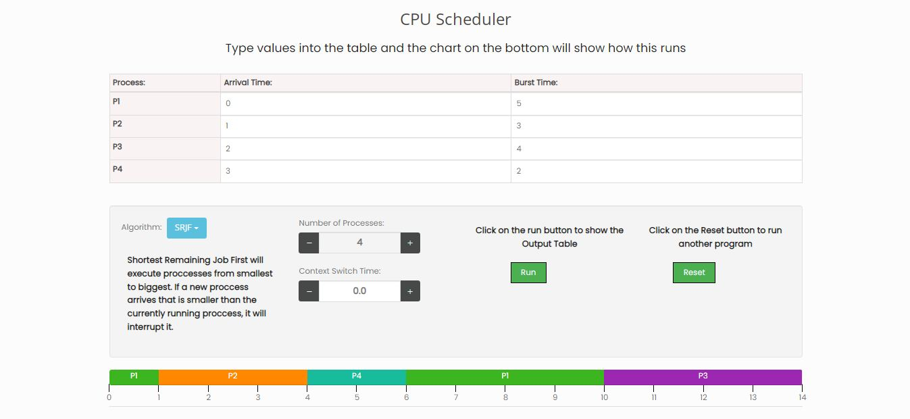
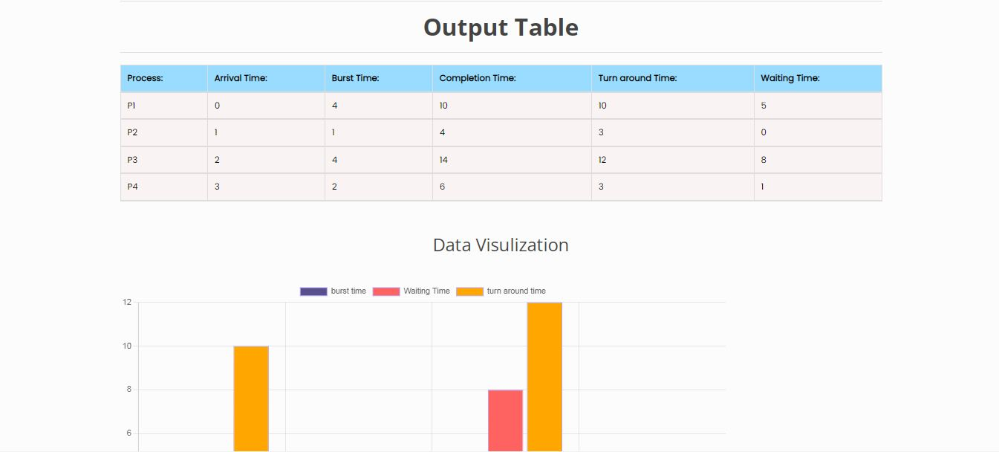
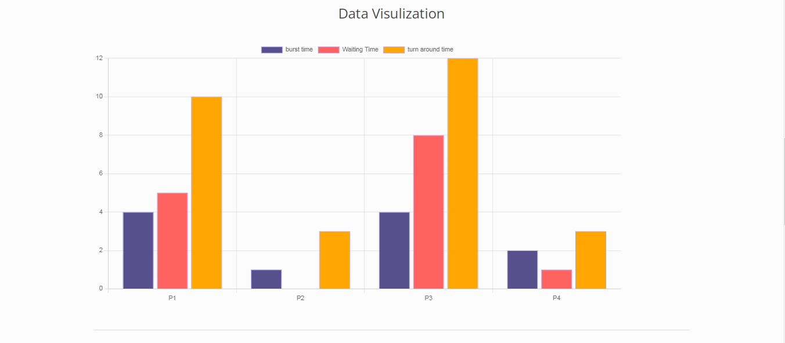
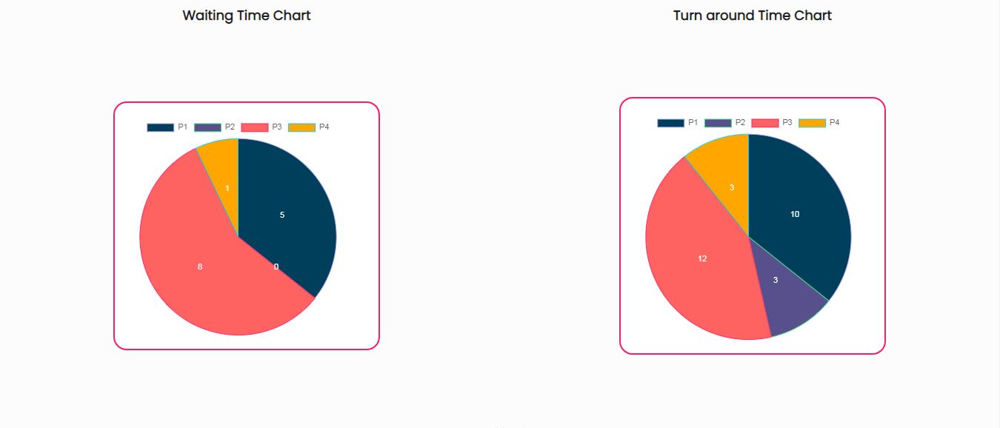
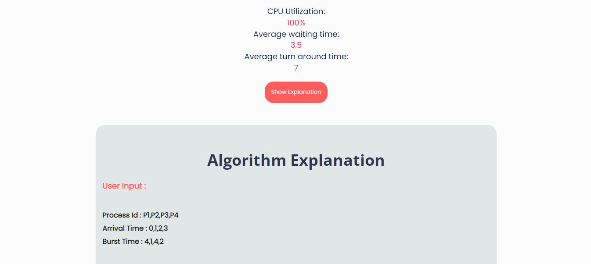
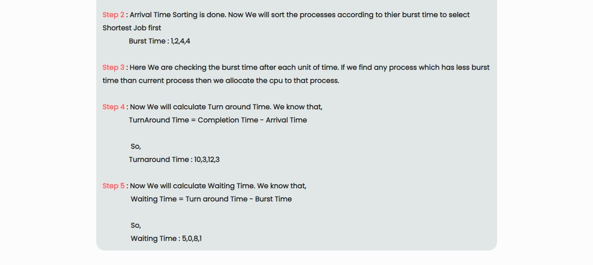

# CPU Scheduler
CPU Scheduling is a process of determining which process will own CPU for execution while another process is on hold. The main task of CPU scheduling is to make sure that whenever the CPU remains idle, the OS at least select one of the processes available in the ready queue for execution. The selection process will be carried out by the CPU scheduler. It selects one of the processes in memory that are ready for execution.

## Project Specifications
There are mainly five types of process scheduling algorithms

- First Come First Serve (FCFS)
- Shortest-Job-First (SJF) Scheduling
- Shortest Remaining Time
- Priority Scheduling
- Round Robin Scheduling

## Live Demo
- [CPU Scheduling](https://swarupkanade.github.io/CPU-Scheduler/)

## Screenshots

